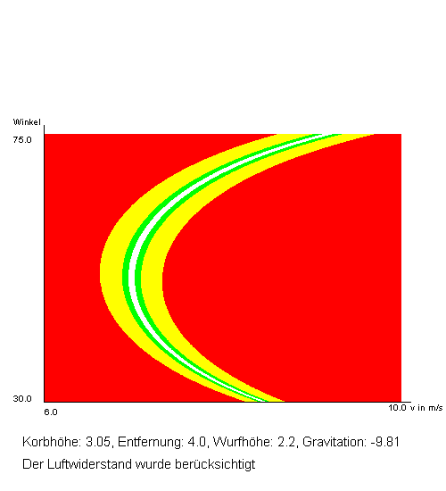

# Simulation eines Basetballwurfs

Das Programm kann einen Basketballwurf unter verschiedenen Bedingungen simulieren und eine Grafik erstellen, die mehrere unterschiedliche Würfe darstellt und die besten farblich hervorhebt.


## Autor

- [@Leon Stopper](https://www.github.com/Le07n)


## Umsetzung

Zur Berechnung wurde die Methode der kleinen Schritte genutzt, um trotz Luftwiderstand einen möglichst genauen Wurf zu ermitteln.


## Generierte Grafik




## Installation

Installiere mein Projekt mit Git Bash

```bash
  git clone https://github.com/Le07n/JugendForscht2025.git
  cd JugendForscht2025
```

Öffne es mit folgendem Befehl

```bash
  java -jar Basketball.jar
```